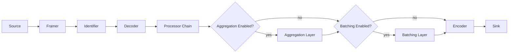
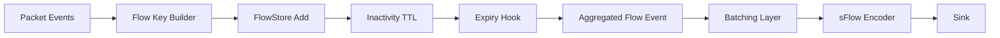
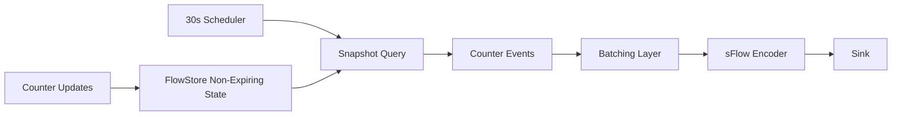
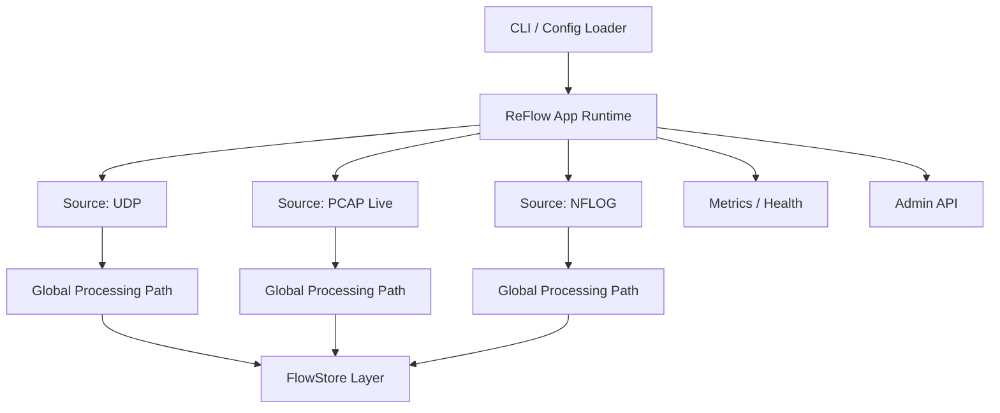
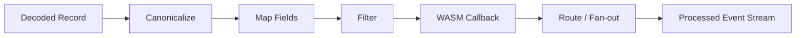
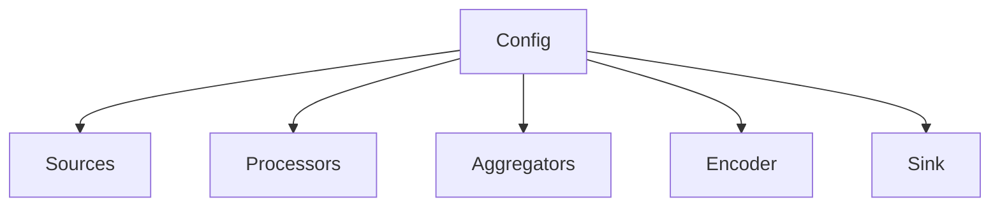

# ReFlow Architecture Plan

## Purpose

This document defines the target architecture for **ReFlow**, a new tool intended to eventually replace the current GoFlow2 application.

ReFlow keeps the core spirit of GoFlow2:

* ingest traffic and telemetry from multiple network-oriented inputs
* decode them into an internal representation
* optionally transform and aggregate them
* emit them through configurable sinks

But it broadens the scope significantly:

* input is no longer limited to UDP NetFlow/IPFIX/sFlow
* payloads may be binary packets, framed messages, JSON objects, or arbitrary byte streams
* decoding must support protocol identification in addition to protocol parsing
* output is no longer limited to protobuf/JSON over file/stdout/Kafka
* ReFlow should be easy to start as a simple collector from the CLI with a usable default configuration

This document is intentionally written for both humans and AI agents working on the future PR/project. It should help answer:

* what ReFlow is
* what should be preserved from GoFlow2
* what should be redesigned
* what the proposed module boundaries are
* what key architectural decisions still need product/engineering input

## Scope Summary

### Current GoFlow2 model

Today, GoFlow2 is mostly:

`UDP listener -> protocol decoder -> producer -> formatter -> transport`

That model works well for:

* UDP-based sFlow
* UDP-based NetFlow v5/v9
* UDP-based IPFIX
* simple stdout/file/Kafka outputs

### Target ReFlow model

ReFlow should evolve the pipeline into:

`source -> framing -> identification -> decode -> process -> aggregate? -> encode -> sink`

Where:

* **source** reads bytes/messages from UDP, sockets, pipes, live capture, or NFLOG
* **framing** splits source input into packet/message boundaries when needed
* **identification** determines what protocol or schema the payload likely is
* **decode** parses the payload into typed internal events
* **process** runs normalization, mapping, enrichment, transformation, and WASM callbacks
* **aggregate** optionally uses FlowStore-backed stateful accumulation and batching
* **encode** turns internal events into JSON, bytes, IPFIX, sFlow, or other output encodings
* **sink** writes to stdout, file, UDP, or sockets/pipes

ReFlow is **not** a strict 1-in / 1-out pipeline:

* one input message may produce zero, one, or many output messages
* multiple input messages may be merged into one later output message
* some outputs are triggered by timers or store expiry rather than by an immediate incoming message

## High-Level Recommendations

These are the main architectural recommendations before implementation starts.

1. Keep ReFlow as a **single-path runtime** in v1, not as a collection of special-case binaries.
2. Separate **transport concerns** from **data-shape concerns**. "JSON over UDP" and "JSON to stdout" should share the same encoder, not duplicate logic.
3. Introduce a first-class **internal event model**. Do not couple sources directly to output encoders.
4. Treat **packet capture** and **message ingestion** as separate source classes. They both ingest bytes, but their semantics are different.
5. Make **protocol identification** explicit and pluggable. This is new compared with GoFlow2 and should not be hidden inside source code.
6. Preserve FlowStore as the default state layer for templates, sampling, and future aggregation, but do not force all processing through aggregation.
7. Keep **WASM limited and capability-based**. It should transform or emit events, not own transport or lifecycle.
8. Start with **single-process, multi-source configuration**. Avoid introducing clustering or distributed coordination into the first architecture.
9. Remove Kafka from the core plan unless a concrete need remains. Vector is a better downstream transport/forwarding boundary.
10. Optimize first for **operability and correctness**, then for deep plugin ecosystems.

## Non-Goals For The First ReFlow Version

The first version should likely avoid:

* distributed clustering
* built-in durable queues
* built-in Kafka producer support
* arbitrary user-defined network transports inside WASM
* a full GUI
* highly dynamic hot-reloadable plugin loading unless operationally necessary

## Proposed Core Concepts

### 1. Source

A `Source` is responsible for ingesting raw bytes or structured messages.

Examples:

* `udp` source
* `unixgram` / `unix` socket source
* `stdin` / named pipe source
* `pcap_live` source
* `nflog` source

Some sources deliver **message boundaries naturally**:

* UDP datagrams
* NFLOG records
* pcap packets

Some sources deliver **streams**:

* pipes
* TCP sockets
* Unix streams

### 2. Framer

A `Framer` turns a raw byte stream into message boundaries.

Examples:

* newline-delimited JSON
* length-prefixed frames
* raw packet frames from pcap records
* pass-through datagram framing

Framing is mandatory for stream sources and optional/no-op for datagram and packet sources.

### 3. Identifier

An `Identifier` classifies a framed payload.

Examples:

* detect `sflow`
* detect `netflow_v5`
* detect `netflow_v9`
* detect `ipfix`
* detect `json`
* detect `raw_bytes`
* detect `unknown`

Identification should output both a **kind** and a **confidence/reason** for metrics and troubleshooting.
Configuration should allow pinning the expected decoder when identification is unnecessary or too costly.

### 4. Decoder

A `Decoder` turns identified payloads into internal events.

Examples:

* `decoder/sflow`
* `decoder/netflow`
* `decoder/ipfix`
* `decoder/json`
* `decoder/bytes`
* `decoder/pcap_l2`

Decoders may emit:

* flow records
* counter records
* packet records
* raw passthrough records
* errors / unsupported payload notices

### 5. Processor

The GoFlow2 `producer` concept becomes a broader `processor` stage.

Possible responsibilities:

* normalization into a common event model
* field mapping
* template/sampling lookup
* packet-to-flow or packet-to-counter conversion
* filtering
* branching
* WASM-based custom transforms
* enrichment hooks

Use `processor` in the new codebase.

### 6. Aggregator

Aggregation should be optional and explicit.

Potential uses:

* flow key rollups
* interface counter accumulation
* periodic flush windows
* stateful packet-to-counter synthesis
* template and sampling cache persistence

Use `FlowStore` as the default in-memory state engine.
Treat template and sampling storage as internal stores, and event aggregation as a separate store usage.

ReFlow should support at least these aggregation/emission modes:

* **expiry-driven aggregation**
  Multiple input events update a FlowStore bucket. When the bucket expires after inactivity, the final aggregated value is emitted downstream.
* **periodic snapshot emission**
  A scheduler queries long-lived or non-expiring FlowStore state and emits snapshots on a fixed cadence.
* **periodic control/protocol emission**
  Timers trigger periodic protocol messages such as IPFIX template refreshes even when no new input arrives.

### 7. Encoder

An `Encoder` serializes internal events for output.

Examples:

* JSON encoder
* text encoder
* bytes encoder
* protobuf encoder if retained
* sFlow encoder

ReFlow must support decoding and protocol re-encoding.

Keep encoders independent from sinks.
Define encoder outputs as either `[]byte` or a small framed-message struct carrying payload plus metadata.

### 8. Sink

A `Sink` emits encoded output to a destination.

Examples:

* stdout sink
* file sink
* UDP sink
* Unix socket sink
* pipe sink

Model sinks as message destinations. Format belongs in the encoder stage.

## Proposed Pipeline



## Message Cardinality

ReFlow should treat cardinality as a first-class property of each stage.

Examples:

* one UDP datagram containing many records becomes many internal events
* one packet event may be dropped and produce no output
* ten packet events may update one FlowStore entry and eventually produce one aggregated flow event
* one periodic scheduler tick may produce many output records from current store state
* one batch flush may produce one encoded sFlow message containing many records

Every stage API should allow `0..N` outputs.
Timer-driven stages should be modeled explicitly, not hidden as side effects inside sinks.

## Stateful Emission Modes

The architecture should explicitly distinguish between event-driven processing and state-driven emission.

The runtime has two related but distinct buffering responsibilities:

* **state accumulation**
  Update FlowStore-backed state keyed by flow, counter, template, or another bucket definition.
* **batch formation**
  Group emitted records before encoding/export when the output protocol benefits from grouped transmission.

Batching may be used with or without stateful aggregation.

### Expiry-Driven Flush

Example:

* packets with the same src/dst/proto/src-port/dst-port map to one aggregation key by default
* each packet updates counters in FlowStore via `Add`
* after 10 seconds of inactivity, the entry expires
* expiry emits the finalized aggregated conversation record into the batching layer
* once the batcher reaches its thresholds, it serializes and sends an output message such as sFlow



Make expiry emission a built-in aggregation pattern.
Keep inactivity TTL and batch thresholds independently configurable.

### Expiry Aggregation Keys

For expiration-driven aggregation, the default key should be:

* `src_addr`
* `dst_addr`
* `proto`
* `src_port`
* `dst_port`

This is the default ReFlow conversation key.

That key should still be customizable.

Customization order:

1. **YAML configuration first**
   Operators should be able to define aggregation fields declaratively.
2. **WASM override second**
   WASM can compute or override keys when vendor-specific payloads or non-standard fields are involved.

Use YAML-defined fields as the primary operator-facing mechanism.
Allow WASM to override key generation for advanced cases.
Expose the effective aggregation key in debug output and metrics where practical.

### Periodic Snapshot Flush

Example:

* interface counters live in FlowStore without expiry
* every 30 seconds, a scheduler walks the relevant keys
* current values are materialized into counter events
* the batching layer and encoder emit an sFlow export



Periodic snapshot emission should be a first-class scheduler + query pattern.
Snapshot semantics must be configurable: current value snapshot, delta since last flush, or reset-on-flush.

Flush triggers emit materialized events into the post-aggregation output path.
Those events may go through transformation, batching, encoding, and then the sink.

### Direct Batching Without Aggregation

Batching can also be used without FlowStore aggregation.

Example:

* packet or message events are transformed directly
* the batching layer groups them into sFlow datagrams
* flush happens on record count, encoded size in bytes, or time

This matters for sFlow because one export packet may carry many samples and packets may be truncated before export.

## Proposed Runtime Topology



## Data Model Recommendation

ReFlow needs a stable internal model. Without it, every source/decoder/encoder combination becomes combinatorially expensive.

Use a layered internal event model.

### Layer A: Envelope

Contains operational metadata about the received unit:

* source ID
* receive timestamp
* transport metadata
* capture metadata
* original protocol hint
* original raw payload reference or copy policy

### Layer B: Event Kind

Each decoded record should have a strongly typed kind, for example:

* `PacketEvent`
* `FlowEvent`
* `CounterEvent`
* `JSONEvent`
* `BytesEvent`
* `ErrorEvent`

### Layer C: Canonical Fields

For flow-like events, define reusable canonical fields:

* addresses
* ports
* protocol numbers
* interface identifiers
* counters
* timestamps
* sampler/exporter identity
* raw/original vendor fields when needed

### Layer D: Output Metadata

Used by routing/encoding/sinks:

* partition key
* sink labels
* content type
* framing instructions
* encoding hints

## Why A Layered Event Model Matters

It allows:

* one decoder to feed multiple processors
* one processor to feed multiple encoders
* simple branching and routing
* protocol transcoding such as JSON -> sFlow counters or packet -> JSON
* consistent metrics and logging

## Canonicalization Recommendation

ReFlow should have a mandatory **canonicalize** step after decode.

Purpose:

* convert protocol-specific decoded records into the ReFlow canonical event model
* expose stable built-in fields such as `src_addr`, `dst_addr`, `proto`, `src_port`, `dst_port`
* preserve protocol-specific extensions when fidelity matters
* provide the typed event boundary used by aggregation, routing, encoding, and WASM

Treat canonicalization as a built-in runtime stage, not as an optional user processor.
Do not require operators to list it explicitly in config.
Allow limited configuration of canonicalization behavior globally or per source when needed.

### Why It Is Usually Implicit

Because it is mandatory, listing it in every pipeline adds noise without adding real flexibility.

Recommended model:

* `decode` outputs protocol-native decoded records
* runtime immediately `canonicalizes` them
* user-configured processors run after canonicalization

Only expose explicit config if you later support alternate canonicalization policies or source-specific modes.

## Processing Model Recommendation

Use a chain-of-responsibility model:



Each processor should be able to:

* pass through
* mutate
* drop
* emit multiple events
* return structured errors

Design the processor API around `[]Event` or an iterator-style emission callback, not a strict 1:1 transform.

The same non-1:1 rule should apply across processors, aggregators, and encoders.

## Batching And Aggregation

Aggregation and batching are separate concerns.

Responsibilities of the aggregation layer:

* accumulate keyed state in FlowStore
* emit finalized records on expiry
* emit snapshots on fixed intervals

Responsibilities of the batching layer:

* group records into batches until thresholds are met
* flush on count, encoded size in bytes, time, or shutdown
* preserve export-session context when needed before encoding

Examples:

* aggregate expired conversations and then batch them into one sFlow export packet
* collect periodic counter records into one sFlow message
* batch transformed packet events directly into one sFlow packet without FlowStore aggregation

Support aggregation modes with and without batching.
Support batching with and without aggregation.
Keep simple immediate single-path operation possible by skipping both.

## WASM Integration Recommendation

WASM is useful here, but it must be constrained.

### Good WASM responsibilities

* transform one event into another
* map JSON payloads into canonical counters/flows
* implement lightweight custom logic for proprietary schemas
* generate derived events

### Bad WASM responsibilities

* opening sockets
* file lifecycle ownership
* direct FlowStore mutation without guardrails
* arbitrary process management

### Proposed WASM API shape

WASM should register callbacks such as:

* `on_json`
* `on_bytes`
* `on_packet`
* `on_flow`
* `on_counter`

And return:

* zero events
* one event
* many events
* structured error information

Use host-managed capability injection.
The WASM module should call a small host ABI, not own broad runtime access.
Keep the ABI versioned from day one.

### WASM ABI Direction

If the canonical event model is also the WASM boundary, ReFlow should use a typed ABI rather than ad hoc JSON as the primary interface.

Direction:

* define the canonical event schema as the host/plugin contract
* use WIT if adopting the WASM component model
* keep the ABI versioned from day one
* allow protocol-specific extension payloads alongside stable canonical fields

This keeps the fast path on typed data and makes WASM part of the event runtime.

## Encoding Recommendation

ReFlow needs outbound encoders for:

* JSON
* raw bytes
* sFlow

Possibly also:

* protobuf, if backward compatibility with current consumers matters
* text, mainly for diagnostics

### Suggested encoder split

1. `event encoder`
   Converts internal event types into protocol-specific records.
2. `frame encoder`
   Applies wire framing if needed.
3. `sink writer`
   Sends the bytes.

This avoids mixing:

* protocol structure
* framing
* destination I/O

For sFlow specifically, the encoder layer may operate on batches rather than single events.

## Source Taxonomy Recommendation

### Packet sources

Packet sources deliver link/network packets:

* `pcap_live`
* `nflog`

These should produce `PacketEvent` first, then optionally pass through packet decoders or custom processors.

### Message sources

Message sources deliver already-formed telemetry messages:

* UDP sFlow/NetFlow/IPFIX
* UDP JSON
* Unix datagram JSON
* pipe newline-delimited JSON
* socket byte stream

These should go through framer + identifier + decoder.

Treat packet sources and message sources as two distinct source families in the code structure and config schema.

## Suggested Repository Structure

One possible shape for the new codebase:

```text
cmd/reflow/
internal/app/
internal/config/
internal/runtime/
internal/source/
internal/source/udp/
internal/source/pcap/
internal/source/nflog/
internal/framing/
internal/identify/
internal/decode/
internal/process/
internal/process/wasm/
internal/aggregate/
internal/encode/
internal/sink/
internal/metrics/
pkg/event/
pkg/flowstore/
pkg/protocol/
```

Keep reusable protocol logic and event types under `pkg/`.
Keep app wiring, config loading, and runtime internals under `internal/`.

Note on repo layout:

* `pkg/goflow2` already contains application wiring for the current GoFlow2 runtime
* ReFlow should start under `internal/` anyway, because its runtime surface is still evolving
* pieces can move into `pkg/` later once they have a clear reuse story and a stable API

## Relationship With Current GoFlow2 Code

### Good candidates for reuse

* protocol decoders for NetFlow/IPFIX/sFlow
* FlowStore
* template store logic
* sampling-rate store logic
* metrics patterns
* app/builder/config separation ideas

### Areas that should be redesigned rather than lifted directly

* `listen` parsing, because the source model is broader now
* `producer`, because the new stage is not just protobuf production
* `format` and `transport`, because ReFlow needs encoder/sink separation
* collector wiring, because it assumes UDP receiver semantics
* the public placement of app wiring under `pkg/goflow2`, which is useful precedent for repo layout but not the best default for a new runtime

## Migration Framing

ReFlow should probably start as a new project/binary rather than a deep in-place refactor of GoFlow2.

Reasons:

* the mental model changes materially
* the config schema will expand a lot
* packet capture and stream framing introduce new concerns
* output encoding direction is no longer one-way normalization only

Build ReFlow in parallel first.
Preserve a compatibility mode only if migration pressure justifies it.

## CLI And Default UX

ReFlow should still be trivial to start.

### Recommendation for default mode

If started with no config:

* enable UDP `sflow://:6343`
* enable UDP `netflow://:2055`
* decode to internal events
* encode as JSON
* emit to stdout

This preserves the current "collector by default" story.

### Recommendation for CLI shape

Prefer:

* `reflow` for default collector mode
* `reflow run -c reflow.yaml` for explicit config-driven mode
* `reflow validate -c reflow.yaml`
* `reflow print-default-config`
* `reflow version`

Avoid:

* an explosion of top-level flags for every source/sink variation

Keep a minimal flag set and move most configuration into YAML.

## Configuration Direction

YAML is the primary and only full config format in v1.
CLI flags are limited to bootstrap behavior and a small set of overrides.

Configuration should define:

* sources
* processors
* aggregators
* encoder
* sink
* observability

### Example configuration sketch

```yaml
sources:
  - id: default-sflow
    type: udp
    listen: ":6343"
    decoder: sflow

  - id: default-netflow
    type: udp
    listen: ":2055"
    decoder: auto_flow

  - id: packet-capture
    type: pcap_live
    interface: eth0
    decode: packet

processors:
  - id: custom-json
    type: wasm
    module: ./plugins/custom_counter.wasm
    on: [json]

aggregators:
  - id: interface-counters
    type: flowstore_window
    flush_interval: 10s
    key_fields: [src_addr, dst_addr, proto, src_port, dst_port]
    batch:
      max_records: 64
      flush_interval: 2s

encoder:
  type: json

sink:
  type: stdout
```

## Config Relationships



## Concurrency Model Suggestions

This area needs deliberate choices early.

### Suggested first version

* one goroutine group per source
* bounded channels between source and global processing stages
* explicit backpressure strategy per source/sink
* fan-out only where needed

### Why not fully async everything

Because:

* packet capture may require loss-aware handling
* UDP sources can tolerate different dropping semantics than pipes
* aggregation may require ordering or keyed serialization
* over-general async graphs become hard to reason about operationally

Start with a small number of concurrency patterns and make them visible in metrics.

## Failure Handling Recommendations

Each stage should classify failures:

* malformed input
* unsupported protocol
* temporary sink failure
* permanent config error
* WASM runtime error
* aggregation/state error
* batch flush error

Add dead-letter style optional outputs later if needed, but do not block the first architecture on that feature.

## Observability Recommendations

ReFlow should expose:

* source ingest rates
* framing errors
* identification success/failure counts
* decoder success/failure counts
* processor drop/mutate/error counts
* aggregator flush/update metrics
* batch size / flush reason metrics
* encoder success/failure counts
* sink queue depth / send failures
* WASM execution duration and errors

Also preserve:

* health endpoint
* metrics endpoint
* structured logs

## Security And Safety Recommendations

Especially important for pcap and WASM.

* WASM execution time and memory must be bounded
* packet parsing should avoid unbounded allocations
* stream framing should have max frame sizes
* configuration should support disabling risky source/sink types
* output encoders should validate generated protocol structures

## Main Open Architectural Questions

These are the highest-value questions to answer before implementation.

### 1. Internal event model depth

Question:

Should ReFlow define a single rich canonical event model for flows/counters/packets, or a thinner envelope with protocol-specific payload variants?

Suggestion:

Start with a hybrid model:

* canonical common fields for shared concepts
* protocol-specific extension payloads when fidelity matters

### 2. Configuration style

Question:

Do you want ReFlow v1 to stay with a single global path in configuration, or leave room now for future graph-style routing?

Suggestion:

Keep v1 configuration single-path. Add graph or pipeline semantics only when a real need appears.

### 3. Output protocol support priority

Question:

What must be available in the first useful ReFlow milestone:

* JSON
* bytes
* sFlow encode
* protobuf compatibility

Suggestion:

Prioritize:

1. JSON
2. bytes
3. sFlow encode
4. only then protobuf compatibility if migration requires it

### 4. Packet decoding boundary

Question:

For packet capture, should ReFlow itself parse L2/L3/L4 and derive higher-level events, or should packet capture mostly be handed to WASM/custom processors?

Suggestion:

ReFlow should own at least basic L2/L3/L4 parsing. Leaving that entirely to WASM would push core correctness and performance into the least safe extension layer.

### 5. FlowStore role

Question:

Should FlowStore remain only a reusable primitive, or should ReFlow define first-class built-in aggregators on top of it?

Suggestion:

Provide first-class built-in aggregators. Otherwise every serious deployment will reinvent the same keyed windows.

### 5b. Flush semantics

Question:

Which built-in flush semantics do you want supported in the first implementation:

* inactivity expiry
* fixed periodic snapshot
* flush-on-size
* flush-on-shutdown

Suggestion:

Implement inactivity expiry, periodic snapshot, flush-on-shutdown, and batching flushes based on count, encoded size in bytes, and time.

### 5c. Aggregation key customization

Question:

Should aggregation keys in YAML be limited to canonical built-in fields, or should configuration also reference custom/vendor fields directly?

Suggestion:

Start with canonical built-in fields in YAML and use WASM overrides for advanced/custom keys. That keeps the base config stable while still allowing specialized logic.

### 6. Ordering guarantees

Question:

Do you require ordering guarantees:

* per source
* per exporter
* per aggregation key
* none

Suggestion:

Define ordering only where state requires it, especially for templates, packet reassembly if any, and keyed aggregation.

### 7. WASM host ABI

Question:

Should WASM operate on JSON-serialized events, protobuf-like binary schemas, or host-native structs exposed through a compact ABI?

Suggestion:

Use a compact versioned host ABI with clear typed operations, not ad hoc JSON as the only interface. JSON can still be an optional convenience wrapper.

### 8. Source plugin model

Question:

Do you expect third parties to add source/decoder/sink plugins outside the main binary, or is compile-time registration acceptable initially?

Suggestion:

Use compile-time registration for v1. Add dynamic plugin loading only if a real extension ecosystem appears.

### 9. Compatibility strategy

Question:

Do you want ReFlow to ingest the same config patterns and operational flags as GoFlow2 where possible, or should it intentionally break and simplify?

Suggestion:

Keep familiar defaults and naming where it helps operators, but do not keep old abstractions if they actively constrain the new architecture.

## Suggested Implementation Phases

### Phase 0: Architecture and interfaces

Deliver:

* event model
* source/framer/identifier/decoder interfaces
* processor/aggregator/encoder/sink interfaces
* config schema draft
* runtime lifecycle model

### Phase 1: Collector-compatible baseline

Deliver:

* UDP source
* sFlow/NetFlow/IPFIX identification + decode
* built-in canonicalize stage
* JSON encoder
* stdout/file/UDP sink support
* default CLI behavior similar to GoFlow2

This phase creates immediate value and a plausible migration path.

### Phase 2: Packet ingestion

Deliver:

* pcap live source
* nflog source
* basic packet decoder
* packet event model

### Phase 3: WASM and aggregation

Deliver:

* WASM processor
* built-in FlowStore aggregators
* batching layer with count, size, and time flush policies
* periodic flush support
* interface counter synthesis examples

### Phase 4: Protocol emission

Deliver:

* sFlow encoder
* socket/pipe sinks with framing

## Architecture Risks

### Risk 1: Over-generalization too early

If everything becomes a plugin and every stage is abstract from day one, the first usable version may take too long.

Mitigation:

* build narrow concrete implementations alongside interfaces

### Risk 2: Weak internal event design

If the event model is underspecified, encoders and processors will bypass it and create coupling.

Mitigation:

* define event kinds early
* decide raw-payload retention policy early

### Risk 3: WASM becomes the escape hatch for missing core features

Mitigation:

* implement the common packet/flow/counter transforms natively first

### Risk 4: Aggregation semantics stay vague

Mitigation:

* define windowing, flush, and keying semantics before adding multiple aggregators

## Decision Log Template

Use this section as implementation begins.

| Topic | Decision | Status | Notes |
|---|---|---|---|
| Internal event model | Hybrid canonical + extension payloads | Proposed | Needs confirmation |
| Config style | Single global path in v1 | Proposed | Lower config and runtime complexity |
| Kafka support | Remove from core ReFlow scope | Proposed | Use Vector downstream |
| FlowStore role | Built-in state engine and aggregator foundation | Proposed | Aligns with current repo strength |
| WASM scope | Processor-only with bounded capabilities | Proposed | Avoid lifecycle/IO ownership |

## Questions For You

These are the questions I would ask you before turning this plan into implementation tickets.

1. Do you want ReFlow’s internal model to preserve a high-fidelity original record alongside canonical fields, or is canonical output the primary goal?
2. For packet capture, do you need only metadata/counters, or do you expect packet payload inspection and protocol parsing beyond L4?
3. Is protobuf compatibility needed for migration, or can ReFlow break from that and standardize on JSON/bytes plus protocol encoders?
4. For WASM, is the main use case transformation and aggregation key generation only, or do you also need lifecycle hooks later?
5. Should FlowStore aggregation support inactivity expiry, periodic snapshot, flush-on-size, and flush-on-shutdown in v1?
6. Is live packet capture expected to run with privileged local access only, or do you want a model that separates capture from processing for safer deployments?
7. Do you want ReFlow to live inside this repository initially, or do you already expect a separate repository/new module?

## Suggested Initial Project Statement

If you want a concise framing for the future PR/project description:

> ReFlow is a configurable traffic and telemetry runtime that ingests packets or framed messages from multiple sources, identifies and decodes them into internal events, processes and optionally aggregates them, then emits them as JSON or sFlow to a configured sink.

## Suggested PR Title

`docs(reflow): add initial architecture plan`
