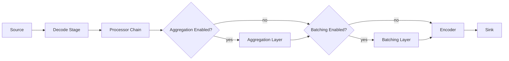
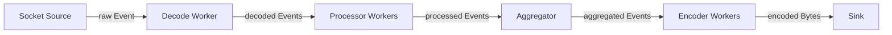
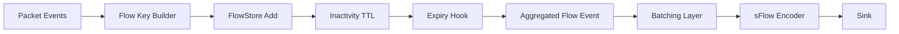
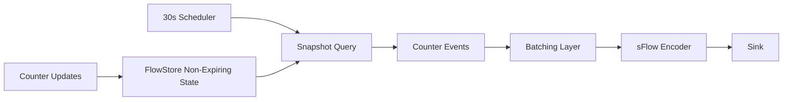
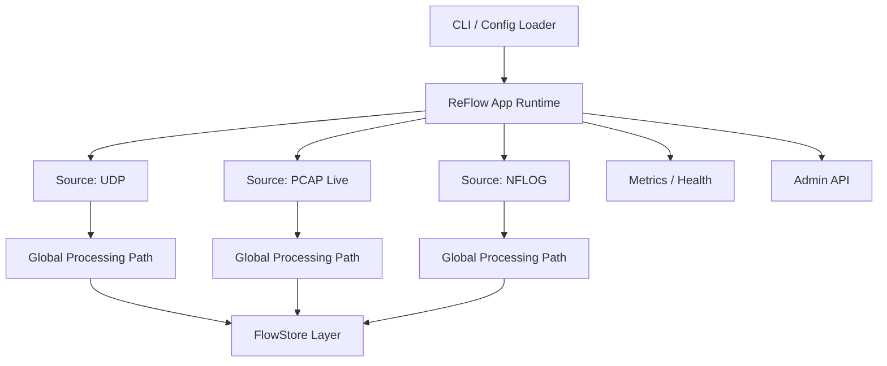
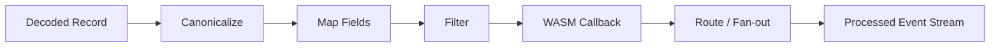
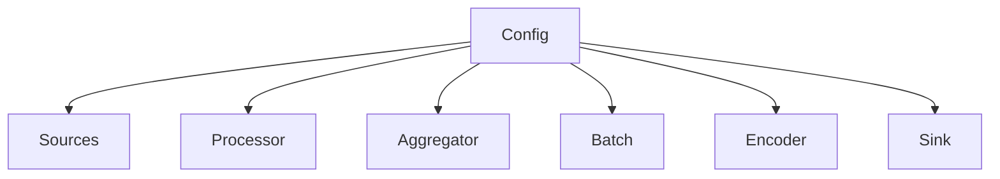

# ReFlow Architecture Plan

## Purpose

This document defines the target architecture for **ReFlow**, a new tool intended to eventually replace the current GoFlow2 application.

ReFlow keeps the core spirit of GoFlow2:

* ingest traffic and telemetry from multiple network-oriented inputs
* decode them into an internal representation
* optionally transform and aggregate them
* emit them through configurable sinks

But it broadens the scope significantly:

* input is no longer limited to UDP NetFlow/IPFIX/sFlow
* payloads may be binary packets, JSON objects, or arbitrary byte streams
* decoding must support protocol identification in addition to protocol parsing
* output is no longer limited to protobuf/JSON over file/stdout/Kafka
* ReFlow should be easy to start as a simple collector from the CLI with a usable default configuration

This document is intentionally written for both humans and AI agents working on the future PR/project. It should help answer:

* what ReFlow is
* what should be preserved from GoFlow2
* what should be redesigned
* what the proposed module boundaries are
* what key architectural decisions still need product/engineering input

## Scope Summary

### Current GoFlow2 model

Today, GoFlow2 is mostly:

`UDP listener -> protocol decoder -> producer -> formatter -> transport`

That model works well for:

* UDP-based sFlow
* UDP-based NetFlow v5/v9
* UDP-based IPFIX
* simple stdout/file/Kafka outputs

### Target ReFlow model

ReFlow should evolve the pipeline into:

`source -> decode -> process -> aggregate? -> batch? -> encode -> sink`

Where:

* **source** reads datagrams or packets from UDP, Unix datagram sockets, live capture, or NFLOG
* **decode** identifies the payload type when needed and parses it into typed internal events
* **process** runs canonicalization, mapping, enrichment, transformation, and optional WASM callbacks
* **aggregate** optionally uses FlowStore-backed stateful accumulation
* **encode** turns internal events into JSON, bytes, and sFlow output encodings
* **sink** writes to stdout, file, or UDP

ReFlow is **not** a strict 1-in / 1-out pipeline:

* one input message may produce zero, one, or many output messages
* multiple input messages may be merged into one later output message
* some outputs are triggered by timers or store expiry rather than by an immediate incoming message

## High-Level Recommendations

These are the main architectural recommendations before implementation starts.

1. Keep ReFlow as a **single-path runtime** in v1, not as a collection of special-case binaries.
2. Separate **transport concerns** from **data-shape concerns**. "JSON over UDP" and "JSON to stdout" should share the same encoder, not duplicate logic.
3. Introduce a first-class **internal event model**. Do not couple sources directly to output encoders.
4. Treat **packet capture** and **message ingestion** as separate source classes.
5. Keep **protocol identification** explicit and decoder-owned. Source code should stay transport-focused.
6. Preserve FlowStore as the default state layer for aggregation and protocol state, but do not force all processing through aggregation.
7. Keep **WASM limited and capability-based**. It should transform or emit events, not own transport or lifecycle.
8. Start with **single-process, multi-source configuration** and a single sink.
9. Remove Kafka from the core plan unless a concrete need remains. Vector is a better downstream transport/forwarding boundary.
10. Optimize first for **operability and correctness**, then for deep plugin ecosystems.

## Non-Goals For The First ReFlow Version

The first version should likely avoid:

* distributed clustering
* built-in durable queues
* built-in Kafka producer support
* arbitrary user-defined network transports inside WASM
* a full GUI
* highly dynamic hot-reloadable plugin loading unless operationally necessary

## V1 Assumptions

The current v1 scope assumes:

* multiple sources
* a single optional processor entry
* a built-in in-code processor when no WASM processor is configured
* a single optional aggregator entry
* a single optional batch entry
* a single encoder
* a single sink
* packet parsing up to L4
* JSON output and sFlow encoding as the first output priorities
* YAML as the only full config format

## Proposed Core Concepts

### 1. Source

A `Source` is responsible for ingesting raw bytes or structured messages.

Examples:

* `udp` source
* `unixgram` / `unix` socket source
* `pcap_live` source
* `nflog` source

Some sources deliver **message boundaries naturally**:

* UDP datagrams
* NFLOG records
* pcap packets

Some sources deliver **streams**:

* TCP sockets
* Unix streams

These are future concerns, not required for the current v1 path.

### 2. Decoder

A `Decoder` identifies payloads when needed and turns them into internal events.

Examples:

* `decoder/flow` with protocol identification for `sflow`, `netflow_v5`, `netflow_v9`, and `ipfix`
* `decoder/json`
* `decoder/bytes`
* `decoder/pcap_l2`

Decoders may emit:

* identified but still-raw flow records
* flow records
* counter records
* packet records
* raw passthrough records
* errors / unsupported payload notices

For `source.type: flow`, protocol identification belongs in the decoder stage rather than in the source.
That keeps the source transport-oriented and lets the decoder own both dispatch and protocol parsing.

### 3. Processor

The GoFlow2 `producer` concept becomes a broader `processor` stage.

Possible responsibilities:

* normalization into a common event model
* field mapping
* template/sampling lookup
* packet-to-flow or packet-to-counter conversion
* filtering
* branching
* WASM-based custom transforms
* enrichment hooks

Use `processor` in the new codebase.

### 4. Aggregator

Aggregation should be optional and explicit.

Potential uses:

* flow key rollups
* interface counter accumulation
* periodic flush windows
* stateful packet-to-counter synthesis
* protocol state persistence when needed

Use `FlowStore` as the default in-memory state engine.

ReFlow should support at least these aggregation/emission modes:

* **expiry-driven aggregation**
  Multiple input events update a FlowStore bucket. When the bucket expires after inactivity, the final aggregated value is emitted downstream.
* **periodic snapshot emission**
  A scheduler queries long-lived or non-expiring FlowStore state and emits snapshots on a fixed cadence.
### 5. Encoder

An `Encoder` serializes internal events for output.

Examples:

* JSON encoder
* text encoder
* bytes encoder
* sFlow encoder

ReFlow must support decoding and protocol re-encoding.

Keep encoders independent from sinks.
Define encoder outputs as either `[]byte` or a small framed-message struct carrying payload plus metadata.

### 6. Sink

A `Sink` emits encoded output to a destination.

Examples:

* stdout sink
* file sink
* UDP sink
* Unix socket sink
* pipe sink

Model sinks as message destinations. Format belongs in the encoder stage.

## Proposed Pipeline



## Current Runtime Wiring

The current ReFlow implementation uses a dedicated decode stage in the runtime.



Current behavior:

* `source.type: json` emits JSON payload events directly
* `source.type: flow` emits raw datagram events and the decode stage identifies `sflow`, `netflow_v5`, `netflow_v9`, or `ipfix`
* `source.type: bytes` emits opaque byte events and the built-in processor rejects them, leaving a placeholder path for a future WASM processor

## Message Cardinality

ReFlow should treat cardinality as a first-class property of each stage.

Examples:

* one UDP datagram containing many records becomes many internal events
* one packet event may be dropped and produce no output
* ten packet events may update one FlowStore entry and eventually produce one aggregated flow event
* one periodic scheduler tick may produce many output records from current store state
* one batch flush may produce one encoded sFlow message containing many records

Every stage API should allow `0..N` outputs.
Timer-driven stages should be modeled explicitly, not hidden as side effects inside sinks.

## Stateful Emission Modes

The architecture should explicitly distinguish between event-driven processing and state-driven emission.

The runtime has two related but distinct buffering responsibilities:

* **state accumulation**
  Update FlowStore-backed state keyed by flow, counter, template, or another bucket definition.
* **batch formation**
  Group emitted records before encoding/export when the output protocol benefits from grouped transmission.

Batching may be used with or without stateful aggregation.

### Expiry-Driven Flush

Example:

* packets with the same src/dst/proto/src-port/dst-port map to one aggregation key by default
* each packet updates counters in FlowStore via `Add`
* after 10 seconds of inactivity, the entry expires
* expiry emits the finalized aggregated conversation record into the batching layer
* once the batcher reaches its thresholds, it serializes and sends an output message such as sFlow



Make expiry emission a built-in aggregation pattern.
Keep inactivity TTL and batch thresholds independently configurable.

### Expiry Aggregation Keys

For expiration-driven aggregation, the default key should be:

* `src_addr`
* `dst_addr`
* `proto`
* `src_port`
* `dst_port`

This is the default ReFlow conversation key.

That key should still be customizable.

Customization order:

1. **YAML configuration first**
   Operators should be able to define aggregation fields declaratively.
2. **WASM override second**
   WASM can compute or override keys when vendor-specific payloads or non-standard fields are involved.

Use YAML-defined fields as the primary operator-facing mechanism.
Allow WASM to override key generation for advanced cases.
Expose the effective aggregation key in debug output and metrics where practical.

### Periodic Snapshot Flush

Example:

* interface counters live in FlowStore without expiry
* every 30 seconds, a scheduler walks the relevant keys
* current values are materialized into counter events
* the batching layer and encoder emit an sFlow export



Periodic snapshot emission should be a first-class scheduler + query pattern.
Snapshot semantics must be configurable: current value snapshot, delta since last flush, or reset-on-flush.

Flush triggers emit materialized events into the post-aggregation output path.
Those events may go through transformation, batching, encoding, and then the sink.

### Direct Batching Without Aggregation

Batching can also be used without FlowStore aggregation.

Example:

* packet or message events are transformed directly
* the batching layer groups them into sFlow datagrams
* flush happens on record count, encoded size in bytes, or time

This matters for sFlow because one export packet may carry many samples and packets may be truncated before export.

## Proposed Runtime Topology



## Data Model Recommendation

ReFlow needs a stable internal model. Without it, every source/decoder/encoder combination becomes combinatorially expensive.

Use a layered internal event model.

### Layer A: Envelope

Contains operational metadata about the received unit:

* source ID
* receive timestamp
* transport metadata
* capture metadata
* original protocol hint
* original raw payload reference or copy policy

### Layer B: Event Kind

Each decoded record should have a strongly typed kind, for example:

* `PacketEvent`
* `FlowEvent`
* `CounterEvent`
* `JSONEvent`
* `BytesEvent`
* `ErrorEvent`

### Layer C: Canonical Fields

For flow-like events, define reusable canonical fields:

* addresses
* ports
* protocol numbers
* interface identifiers
* counters
* timestamps
* sampler/exporter identity
* raw/original vendor fields when needed

### Layer D: Output Metadata

Used by routing/encoding/sinks:

* partition key
* sink labels
* content type
* encoding hints

## Event Message Definition

The canonical event message should be a single envelope with:

* source metadata
* event kind
* canonical fields
* optional protocol-specific extensions
* optional raw/original payload
* output metadata

A concrete shape for v1:

```go
type Event struct {
    Meta       EventMeta         `json:"meta"`
    Kind       EventKind         `json:"kind"`
    Canonical  CanonicalFields   `json:"canonical,omitempty"`
    Extensions []ExtensionField  `json:"extensions,omitempty"`
    Raw        *RawPayload       `json:"raw,omitempty"`
    Output     OutputMetadata    `json:"output,omitempty"`
}

type EventMeta struct {
    SourceID      string    `json:"source_id,omitempty"`
    SourceType    string    `json:"source_type,omitempty"`
    ReceiveTime   time.Time `json:"receive_time"`
    ProtocolHint  string    `json:"protocol_hint,omitempty"`
    RemoteAddr    string    `json:"remote_addr,omitempty"`
    CaptureType   string    `json:"capture_type,omitempty"`
}

type EventKind string

const (
    EventPacket  EventKind = "packet"
    EventFlow    EventKind = "flow"
    EventCounter EventKind = "counter"
    EventJSON    EventKind = "json"
    EventBytes   EventKind = "bytes"
    EventError   EventKind = "error"
)

type CanonicalFields struct {
    SrcAddr   string `json:"src_addr,omitempty"`
    DstAddr   string `json:"dst_addr,omitempty"`
    Proto     uint32 `json:"proto,omitempty"`
    SrcPort   uint32 `json:"src_port,omitempty"`
    DstPort   uint32 `json:"dst_port,omitempty"`
    Bytes     uint64 `json:"bytes,omitempty"`
    Packets   uint64 `json:"packets,omitempty"`
    InIf      uint32 `json:"in_if,omitempty"`
    OutIf     uint32 `json:"out_if,omitempty"`
    TimeStart uint64 `json:"time_start_ns,omitempty"`
    TimeEnd   uint64 `json:"time_end_ns,omitempty"`
}

type ExtensionField struct {
    Name  string         `json:"name"`
    Value ExtensionValue `json:"value"`
}

type ExtensionValue struct {
    Type   string  `json:"type"`
    String string  `json:"string,omitempty"`
    Bytes  []byte  `json:"bytes,omitempty"`
    Int64  int64   `json:"int64,omitempty"`
    Uint64 uint64  `json:"uint64,omitempty"`
    Double float64 `json:"double,omitempty"`
    Bool   bool    `json:"bool,omitempty"`
}

type RawPayload struct {
    Format string `json:"format,omitempty"`
    Data   []byte `json:"data,omitempty"`
}

type OutputMetadata struct {
    ContentType string   `json:"content_type,omitempty"`
    PartitionKey string  `json:"partition_key,omitempty"`
    SinkLabels  []string `json:"sink_labels,omitempty"`
}
```

Notes:

* `Meta` and `Kind` are always present.
* `Canonical` contains the stable built-in fields used by processors, aggregators, batchers, encoders, and WASM.
* `Extensions` carries protocol-specific or vendor-specific fields that do not belong in the stable canonical set.
* `Extensions` should use typed key/value entries rather than `map[string]any`.
* `Raw` is optional and may be dropped by processors as soon as it is no longer needed.
* `Output` is optional and lets processors or aggregators attach delivery hints without coupling to a sink implementation.

The exact field set will evolve, but the model should stay as one envelope plus typed kind plus canonical fields.

## Why A Layered Event Model Matters

It allows:

* one decoder to feed multiple processors
* one processor to feed multiple encoders
* simple branching and routing
* protocol transcoding such as JSON -> sFlow counters or packet -> JSON
* consistent metrics and logging

## Canonicalization Recommendation

ReFlow should have a mandatory **canonicalize** step after decode.

Purpose:

* convert protocol-specific decoded records into the ReFlow canonical event model
* expose stable built-in fields such as `src_addr`, `dst_addr`, `proto`, `src_port`, `dst_port`
* preserve protocol-specific extensions when fidelity matters
* provide the typed event boundary used by aggregation, routing, encoding, and WASM

Treat canonicalization as a built-in runtime stage, not as an optional user processor.
Do not require operators to list it explicitly in config.
Allow limited configuration of canonicalization behavior globally or per source when needed.

### Why It Is Usually Implicit

Because it is mandatory, listing it in every pipeline adds noise without adding real flexibility.

Recommended model:

* `decode` outputs protocol-native decoded records
* runtime immediately `canonicalizes` them
* user-configured processors run after canonicalization

Only expose explicit config if you later support alternate canonicalization policies or source-specific modes.

## Processing Model Recommendation

Use a chain-of-responsibility model:



Each processor should be able to:

* pass through
* mutate
* drop
* emit multiple events
* return structured errors

Design the processor API around `[]Event` or an iterator-style emission callback, not a strict 1:1 transform.

The same non-1:1 rule should apply across processors, aggregators, and encoders.

## Batching And Aggregation

Aggregation and batching are separate concerns.

Responsibilities of the aggregation layer:

* accumulate keyed state in FlowStore
* emit finalized records on expiry
* emit snapshots on fixed intervals

Responsibilities of the batching layer:

* group records into batches until thresholds are met
* flush on count, encoded size in bytes, time, or shutdown
* preserve export-session context when needed before encoding

Examples:

* aggregate expired conversations and then batch them into one sFlow export packet
* collect periodic counter records into one sFlow message
* batch transformed packet events directly into one sFlow packet without FlowStore aggregation

Support aggregation modes with and without batching.
Support batching with and without aggregation.
Keep simple immediate single-path operation possible by skipping both.

## WASM Integration Recommendation

WASM is useful here, but it must be constrained.

### Good WASM responsibilities

* transform one event into another
* map JSON payloads into canonical counters/flows
* implement lightweight custom logic for proprietary schemas
* generate derived events

### Bad WASM responsibilities

* opening sockets
* file lifecycle ownership
* direct FlowStore mutation without guardrails
* arbitrary process management

### Proposed WASM API shape

WASM should register callbacks such as:

* `on_json`
* `on_bytes`
* `on_packet`
* `on_flow`
* `on_counter`

And return:

* zero events
* one event
* many events
* structured error information

Use host-managed capability injection.
The WASM module should call a small host ABI, not own broad runtime access.
Keep the ABI versioned from day one.

### WASM ABI Direction

If the canonical event model is also the WASM boundary, ReFlow should use a typed ABI rather than ad hoc JSON as the primary interface.

Direction:

* define the canonical event schema as the host/plugin contract
* use WIT if adopting the WASM component model
* keep the ABI versioned from day one
* allow protocol-specific extension payloads alongside stable canonical fields

This keeps the fast path on typed data and makes WASM part of the event runtime.

## Encoding Recommendation

ReFlow needs outbound encoders for:

* JSON
* raw bytes
* sFlow

Possibly also:

* protobuf, if backward compatibility with current consumers matters
* text, mainly for diagnostics

### Suggested encoder split

1. `event encoder`
   Converts internal event types into protocol-specific records.
2. `frame encoder`
   Applies wire-level encoding details if needed.
3. `sink writer`
   Sends the bytes.

This avoids mixing:

* protocol structure
* wire encoding details
* destination I/O

For sFlow specifically, the encoder layer may operate on batches rather than single events.

## Source Taxonomy Recommendation

### Packet sources

Packet sources deliver link/network packets:

* `pcap_live`
* `nflog`

These should produce `PacketEvent` first, then optionally pass through packet decoders or custom processors.

### Message sources

Message sources deliver already-formed telemetry messages:

* UDP sFlow/NetFlow/IPFIX
* UDP JSON
* Unix datagram JSON

These should go through identifier + decoder.

Treat packet sources and message sources as two distinct source families in the code structure and config schema.

## Suggested Repository Structure

One possible shape for the new codebase:

```text
cmd/reflow/
internal/app/
internal/config/
internal/runtime/
internal/source/
internal/source/udp/
internal/source/pcap/
internal/source/nflog/
internal/identify/
internal/decode/
internal/process/
internal/process/wasm/
internal/aggregate/
internal/encode/
internal/sink/
internal/metrics/
pkg/event/
pkg/flowstore/
pkg/protocol/
```

Keep reusable protocol logic and event types under `pkg/`.
Keep app wiring, config loading, and runtime internals under `internal/`.

Note on repo layout:

* `pkg/goflow2` already contains application wiring for the current GoFlow2 runtime
* ReFlow should start under `internal/` anyway, because its runtime surface is still evolving
* pieces can move into `pkg/` later once they have a clear reuse story and a stable API

## Relationship With Current GoFlow2 Code

### Good candidates for reuse

* protocol decoders for NetFlow/IPFIX/sFlow
* FlowStore
* template store logic
* sampling-rate store logic
* metrics patterns
* app/builder/config separation ideas

### Areas that should be redesigned rather than lifted directly

* `listen` parsing, because the source model is broader now
* `producer`, because the new stage is not just protobuf production
* `format` and `transport`, because ReFlow needs encoder/sink separation
* collector wiring, because it assumes UDP receiver semantics
* the public placement of app wiring under `pkg/goflow2`, which is useful precedent for repo layout but not the best default for a new runtime

## Migration Framing

ReFlow should probably start as a new project/binary rather than a deep in-place refactor of GoFlow2.

Reasons:

* the mental model changes materially
* the config schema will expand a lot
* packet capture introduces new concerns
* output encoding direction is no longer one-way normalization only

Build ReFlow in parallel first.
Preserve a compatibility mode only if migration pressure justifies it.

## CLI And Default UX

ReFlow should still be trivial to start.

### Recommendation for default mode

If started with no config:

* enable UDP `sflow://:6343`
* enable UDP `netflow://:2055`
* decode to internal events
* encode as JSON
* emit to stdout

This preserves the current "collector by default" story.

### Recommendation for CLI shape

Prefer:

* `reflow` for default collector mode
* `reflow run -c reflow.yaml` for explicit config-driven mode
* `reflow validate -c reflow.yaml`
* `reflow print-default-config`
* `reflow version`

Avoid:

* an explosion of top-level flags for every source/sink variation

Keep a minimal flag set and move most configuration into YAML.

## Configuration Direction

YAML is the primary and only full config format in v1.
CLI flags are limited to bootstrap behavior and a small set of overrides.

Configuration should define:

* sources
* processor
* aggregator
* batch
* encoder
* sink
* observability

The processor is optional.
If no WASM processor is configured, ReFlow uses a built-in in-code processor.

The aggregator is also optional.
When enabled, v1 uses a single aggregation entry.

The batch layer is optional.
When enabled, v1 uses a single batch entry.

### Example configuration sketch

```yaml
sources:
  - id: default-sflow
    type: udp
    listen: ":6343"
    decoder: sflow

  - id: default-netflow
    type: udp
    listen: ":2055"
    decoder: auto_flow

  - id: packet-capture
    type: pcap_live
    interface: eth0
    decode: packet

processor:
  type: wasm
  module: ./plugins/custom_counter.wasm
  on: [json]

aggregator:
  type: window
  flush_interval: 10s
  key_fields: [src_addr, dst_addr, proto, src_port, dst_port]
  sum: [bytes, packets]
  first: [agent_ip, src_addr, dst_addr, proto, src_port, dst_port, flow_start_ns]
  current: [agent_ip, input_if, output_if, sampling_rate, sample_pool, drops, flow_end_ns]

ipfix:
  fields_path: ./reflow-ipfix-fields.yaml
  overrides:
    custom_counter:
      name: customCounter
      id: 1000
      pen: 424242
      enterprise_scoped: true
      length: 8
      type: unsigned64

batch:
  max_records: 64
  max_bytes: 65535
  flush_interval: 2s

encoder:
  type: json

sink:
  type: stdout
```

### Scenario Matrix

The table below is not exhaustive. It is meant to capture common ReFlow paths and show how the same runtime can handle different sources and outputs.

| Input | Source type | Decode / identify | Processor | Aggregator | Batch | Encoder | Output |
|---|---|---|---|---|---|---|---|
| sFlow datagrams from network devices | `udp` | `sflow` | built-in processor | optional | optional | `json` | `stdout` or file |
| NetFlow v9 from routers | `udp` | `netflow_v9` | built-in processor | optional | optional | `json` | `stdout` or file |
| NetFlow v5 from routers | `udp` | `netflow_v5` | built-in processor | optional | optional | `json` | `stdout` or file |
| IPFIX from exporters | `udp` | `ipfix` | built-in processor | optional | optional | `json` | `stdout` or file |
| VPC Flow Logs as JSON lines in datagrams | `udp` or `unixgram` | `json` | WASM or built-in mapping | optional | optional | `json` | `stdout`, file, or UDP |
| Script collecting interface metrics as JSON | `udp` or `unixgram` | `json` | WASM maps fields to counter events | optional | optional | `json` | `stdout`, file, or UDP |
| OpenWrt `ubus` messages exported as JSON | `udp` or `unixgram` | `json` | WASM maps fields to counters or flow-like events | optional | optional | `json` | `stdout`, file, or UDP |
| Raw packet capture from `pcap_live` | `pcap_live` | packet decode up to L4 | built-in processor extracts src/dst/proto/ports | yes | yes | `sflow` | UDP |
| Raw packet capture from `nflog` | `nflog` | packet decode up to L4 | built-in processor extracts src/dst/proto/ports | yes | yes | `sflow` | UDP |
| JSON input converted to sFlow counters | `udp` or `unixgram` | `json` | WASM transforms JSON into counter events | optional | yes | `sflow` | UDP |
| Packet stream converted to aggregated flow export | `pcap_live` or `nflog` | packet decode up to L4 | built-in processor extracts canonical packet fields | yes | yes | `sflow` now, IPFIX later | UDP |

### Packet To Aggregated Export Example

One important scenario for ReFlow is packet-to-flow conversion:

1. A packet source such as `pcap_live` or `nflog` delivers packets.
2. The packet decoder extracts fields such as `src_addr`, `dst_addr`, `proto`, `src_port`, and `dst_port`.
3. The built-in processor materializes a canonical packet or flow-like event.
4. The aggregator uses those fields as the FlowStore key.
5. Packets in the same conversation keep updating the same FlowStore entry.
6. When the bucket expires, the aggregator emits one aggregated flow record to the batch layer.
7. The batch layer groups aggregated records and carries the schema needed by the encoder.
8. The encoder turns the batch into protocol output.

For the future IPFIX path specifically:

* the aggregator emits the aggregated data record together with the schema context needed for export
* the batch layer groups compatible records
* the encoder emits an IPFIX template set plus the matching data set

That gives a clean progression from packet input to aggregated protocol export:

`packet -> canonical event -> FlowStore aggregation -> batch -> IPFIX template + data`

## Config Relationships



## Concurrency Model Suggestions

This area needs deliberate choices early.

### Suggested first version

* one goroutine group per source
* bounded channels between source and global processing stages
* explicit backpressure strategy per source/sink
* fan-out only where needed

### Why not fully async everything

Because:

* packet capture may require loss-aware handling
* UDP sources can tolerate different dropping semantics than pipes
* aggregation may require ordering or keyed serialization
* over-general async graphs become hard to reason about operationally

Start with a small number of concurrency patterns and make them visible in metrics.

## Failure Handling Recommendations

Each stage should classify failures:

* malformed input
* unsupported protocol
* temporary sink failure
* permanent config error
* WASM runtime error
* aggregation/state error
* batch flush error

Add dead-letter style optional outputs later if needed, but do not block the first architecture on that feature.

## Observability Recommendations

ReFlow should expose:

* source ingest rates
* identification success/failure counts
* decoder success/failure counts
* processor drop/mutate/error counts
* aggregator flush/update metrics
* batch size / flush reason metrics
* encoder success/failure counts
* sink queue depth / send failures
* WASM execution duration and errors

Also preserve:

* health endpoint
* metrics endpoint
* structured logs

## Security And Safety Recommendations

Especially important for pcap and WASM.

* WASM execution time and memory must be bounded
* packet parsing should avoid unbounded allocations
* configuration should support disabling risky source/sink types
* output encoders should validate generated protocol structures

## Remaining Open Questions

The main open points are now:

1. Is protobuf compatibility needed at all, or can ReFlow stay focused on JSON, bytes, and sFlow?
2. Do you want to commit to a WASM ABI early, for example via WIT, or leave that open until the event schema settles further?
3. Should FlowStore aggregation in v1 support all of: inactivity expiry, periodic snapshot, flush-on-size, and flush-on-shutdown?
4. Is live capture expected to run only in privileged local deployments, or do you want a cleaner separation between capture and processing later?
5. Should ReFlow stay in this repository initially, or move to a separate repository/module once the scope grows?

## Suggested Implementation Phases

### Phase 0: Architecture and interfaces

Deliver:

* event model
* source/identifier/decoder interfaces
* single processor/aggregator/batch/encoder/sink interfaces
* config schema draft
* runtime lifecycle model

### Phase 1: Collector-compatible baseline

Deliver:

* UDP source
* sFlow/NetFlow/IPFIX identification + decode
* built-in canonicalize stage
* JSON encoder
* stdout/file/UDP sink support
* default CLI behavior similar to GoFlow2

This phase creates immediate value and a plausible migration path.

### Phase 2: Packet ingestion

Deliver:

* pcap live source
* nflog source
* basic packet decoder
* packet event model

### Phase 3: WASM and aggregation

Deliver:

* optional WASM processor
* built-in in-code default processor
* built-in FlowStore aggregator
* batching layer with count, size, and time flush policies
* periodic flush support
* interface counter synthesis examples

### Phase 4: Protocol emission

Deliver:

* sFlow encoder
* UDP sink support for encoded exports

## Architecture Risks

### Risk 1: Over-generalization too early

If everything becomes a plugin and every stage is abstract from day one, the first usable version may take too long.

Mitigation:

* build narrow concrete implementations alongside interfaces

### Risk 2: Weak internal event design

If the event model is underspecified, encoders and processors will bypass it and create coupling.

Mitigation:

* define event kinds early
* decide raw-payload retention policy early

### Risk 3: WASM becomes the escape hatch for missing core features

Mitigation:

* implement the common packet/flow/counter transforms natively first

### Risk 4: Aggregation semantics stay vague

Mitigation:

* define window and periodic semantics before adding more aggregation families

## Decision Log Template

Use this section as implementation begins.

| Topic | Decision | Status | Notes |
|---|---|---|---|
| Internal event model | Canonical envelope + typed extension fields | Decided | Fits WASM and protobuf better |
| Config style | Single global path in v1 | Decided | Lower config and runtime complexity |
| Config format | YAML only for full config in v1 | Decided | CLI is for bootstrap and overrides |
| Sink model | Single sink in v1 | Decided | Simpler runtime and config |
| Processor model | Single optional processor entry | Decided | Built-in processor unless WASM is configured |
| Aggregator model | Single optional aggregator entry | Decided | FlowStore-backed |
| Batch model | Single optional batch entry | Decided | Separate from aggregation |
| Packet parsing | Up to L4 in v1 | Decided | Keeps packet work bounded |
| Output priority | JSON and sFlow | Decided | First useful outputs |
| Kafka support | Remove from core ReFlow scope | Decided | Use Vector downstream when needed |
| WASM scope | Transform and aggregation key generation | Decided | No transport or lifecycle ownership |

## Suggested Initial Project Statement

If you want a concise summary for the future PR/project description:

> ReFlow is a configurable traffic and telemetry runtime that ingests packets or messages from multiple sources, identifies and decodes them into internal events, processes and optionally aggregates them, then emits them as JSON or sFlow to a configured sink.

## Suggested PR Title

`docs(reflow): add initial architecture plan`
