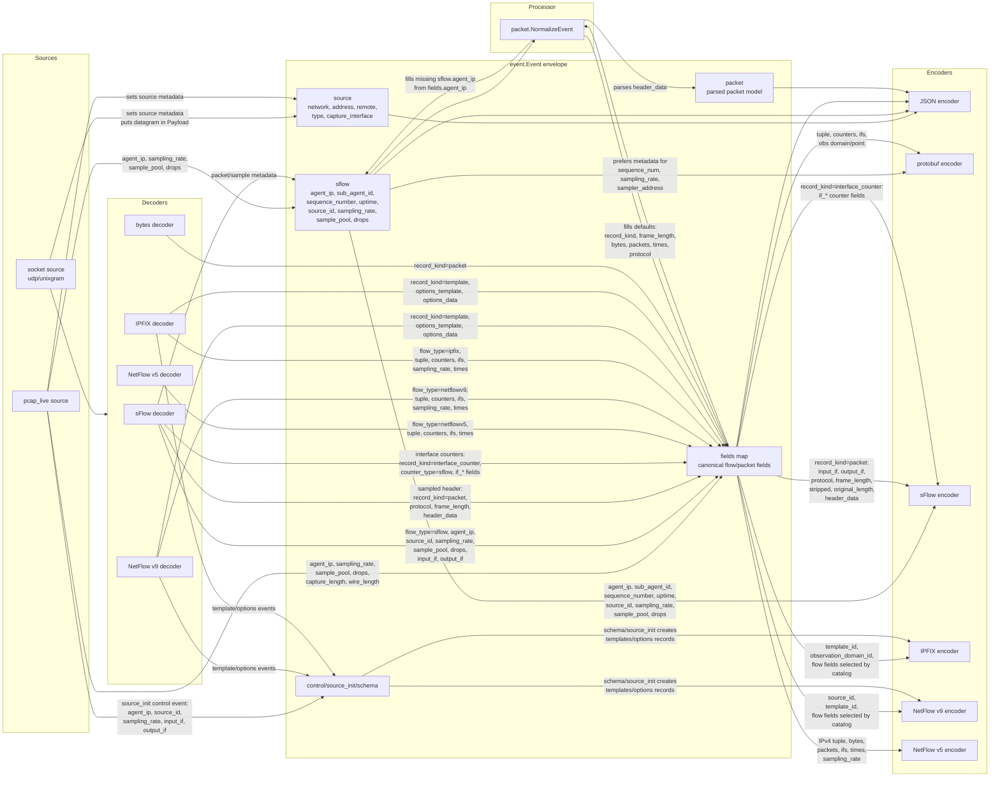

# ReFlow Event Metadata

This page shows which ReFlow stages populate event metadata and which encoders
consume each field. The runtime event shape is defined in
`internal/reflow/event/event.go`.

## Notes

ReFlow has a dedicated top-level `sflow` metadata block. It is populated by
sFlow decoding and by `pcap_live` packet capture, and sFlow/protobuf encoders
prefer it for sFlow-specific values when present.

`record_kind` is the generic record-shape marker. `packet` means the event
carries packet/header bytes in `header_data`; `interface_counter` means the
event carries interface counters; `template`, `options_template`, and
`options_data` represent NetFlow v9/IPFIX template state.

The low-level sFlow decoder understands expanded flow/counter samples and
several sFlow extended records. ReFlow currently projects sampled headers and
interface counters into canonical fields. Other sFlow extended records can be
decoded by the protocol package, but are not yet mapped into ReFlow fields.

IPFIX and NetFlow do not currently have dedicated top-level metadata structs.
Their protocol information is represented through canonical `fields`, control
events, and encoder state. For example, IPFIX output reads
`observation_domain_id`, `template_id`, `sampling_rate`, and flow tuple fields
from `fields`, while schema and source initialization control events drive
template and options output.

Canonical JSON output preserves the event envelope, including `source`,
`sflow`, `fields`, and `packet`. Vendor and GoFlow2-compatible JSON flavors
flatten or select fields and do not preserve the full metadata envelope.
