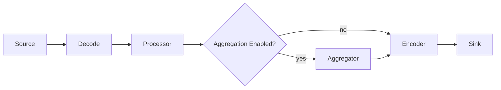
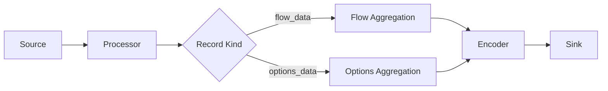

# ReFlow System Notes

This document is a compact description of the current ReFlow direction.

It is meant to help contributors understand the runtime model, the event model, and the planned split between normal flow data and exporter metadata.

## Runtime Shape

ReFlow keeps a simple single-path runtime:

* sources ingest packets or datagrams
* the processor normalizes them into internal events
* aggregation is optional
* the encoder turns events into output bytes
* the sink only transports encoded bytes

### Main Path



The simplified mental model is still:

`source -> processor -> optional aggregator -> sink`

but the encoder sits between the internal event path and the transport sink.

## Event Families

ReFlow should support two templated record families:

* `flow_data`
* `options_data`

`flow_data` is normal traffic or aggregated flow content.

`options_data` is exporter metadata such as:

* sampling rate
* sample pool
* drops
* interface metadata
* exporter identity metadata

The same way data templates can flow through the system, option templates should also flow.

## Source Responsibilities

Sources may emit:

* normal packets or datagrams
* periodic metadata events

Examples of periodic source metadata:

* current sampling rate
* current sample pool
* current drops
* capture interface information

That means a source may emit:

* `flow_data` records
* `options_data` records

For templated flow protocols such as IPFIX, sources or decoders also need protocol state stores.

In practice that means ReFlow should account for at least:

* a template FlowStore for template sets and template lookups
* a sampling-rate FlowStore for exporter or observation-domain sampling metadata

Those stores are separate from normal traffic aggregation. They are part of protocol-state handling for the source/decode side.

## Processor Responsibilities

The processor is the normalization boundary.

It should:

* map source-specific payloads into canonical event fields
* preserve raw payload when needed
* create pseudo packets when configured
* attach exporter metadata when known
* keep `flow_data` and `options_data` explicit

The processor should not do transport-specific work.

## Aggregation

Aggregation is optional.

Current config direction:

* `aggregator.enabled`
* `aggregator.reset_interval_ms`
* `aggregator.periodic_interval_ms`
* `aggregator.key_fields`
* `aggregator.sum`
* `aggregator.first`
* `aggregator.current`
* `aggregator.template_id`
* `aggregator.static_fields`

### Aggregation Semantics

* `sum`: add numeric values into the bucket on every update
* `first`: keep the first value seen when the bucket is created
* `current`: replace with the latest value seen for the bucket

### Two Main Aggregation Modes

1. Keyed flow aggregation

Used for packet or flow rollups.

Typical keys:

* `src_addr`
* `dst_addr`
* `proto`
* `src_port`
* `dst_port`

If `reset_interval_ms > 0`, a bucket is emitted when it has been idle for that amount of time.

2. Accumulative metadata aggregation

Used for current exporter metadata or periodic option-style records.

Typical shape:

* no `key_fields`
* `reset_interval_ms: 0`
* `periodic_interval_ms: 60000`
* mostly `current`

This lets ReFlow keep the current state and emit periodic snapshots without idle-expiry bucket closure.

## Encoder And Sink

The encoder owns protocol semantics.

That means:

* `flow_data` can become data templates plus data records
* `options_data` can become option templates plus option data records

The sink remains transport-only:

* stdout
* file
* UDP
* Unix datagram

The sink should not interpret record kinds.

## Templated Export Fields

Templated exporters should use the shared `tflow_data` config block.

Current direction:

```yaml
encoder:
  type: ipfix
  tflow_data:
    fields_path: reflow-ipfix-fields.yaml
    fields: []
    overrides: {}
```

Meaning:

* `fields: []` means export every field passed into the encoder
* `fields_path` points to the default catalog of templated field definitions
* `overrides` lets config redefine IDs, PEN, lengths, or names

This block is intended to be shared by templated exporters such as:

* IPFIX
* NetFlow v9

## Timestamps

The preferred canonical direction is integer nanoseconds in internal events.

Examples:

* `flow_start_ns`
* `flow_end_ns`

Exporters can then convert those into protocol-specific units during encoding.

## Options Data Direction

A likely next step is to let sources emit periodic `options_data` events that flow into a dedicated aggregation behavior and then into the encoder.

That would look like:



This keeps:

* traffic aggregation separate from exporter metadata aggregation
* data templates separate from option templates
* protocol logic inside the encoder
