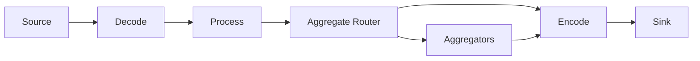
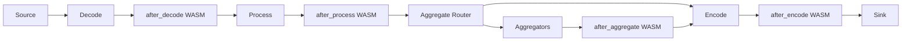
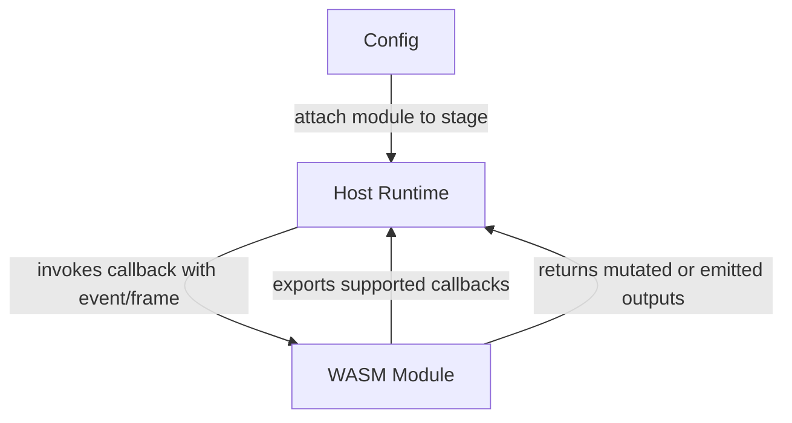
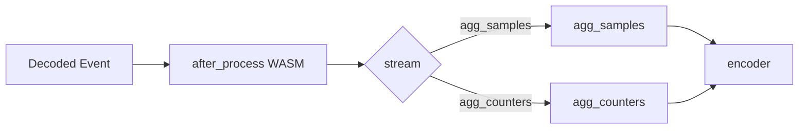
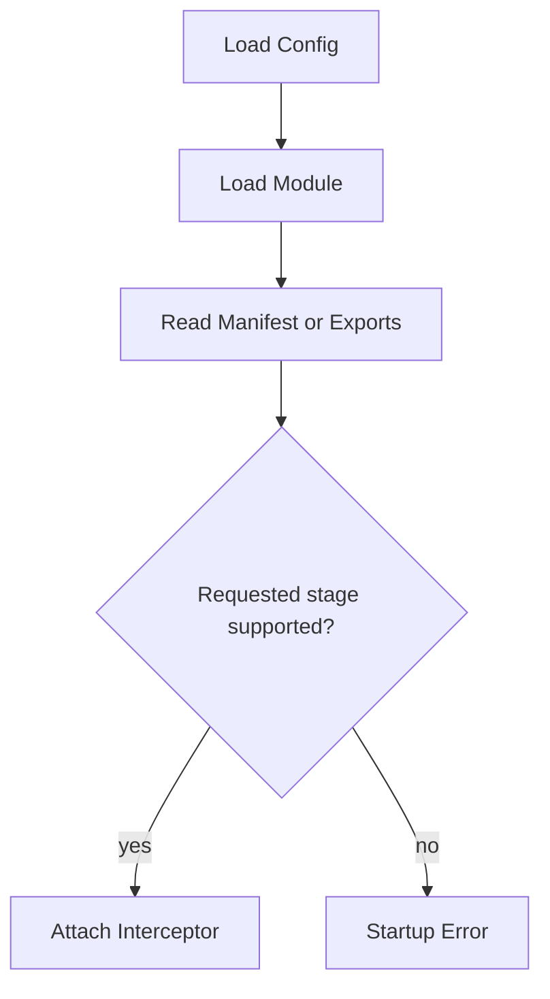

# ReFlow WASM Interceptors

This document sketches a dedicated WASM interception model for ReFlow.

The goal is to make it clear:

* where WASM can fit in the runtime
* what it should and should not control
* how modules are attached to stages
* how stream updates should work
* what ABI shape is appropriate for event hooks versus byte hooks

This is a design note, not an implemented feature.

## Goal

ReFlow already has a stage-based runtime:

`source -> decode -> process -> aggregate -> encode -> sink`

That makes WASM a natural fit as a stage-boundary interceptor.

The intended use cases are:

* mutate canonical events
* assign or rewrite stream names
* emit additional derived events
* drop events
* attach export hints or routing metadata
* run custom logic without giving WASM ownership of sockets, workers, timers, or sinks

The key constraint is that WASM should participate in the event flow, not own the runtime.

## Recommendation

Use host-controlled interceptor attachment.

That means:

* the host defines the valid interception points
* config decides where a module is attached
* the module declares which callbacks it implements
* the host validates the attachment at startup

The module may advertise support for `after_decode` or `after_aggregate`, but it should not dynamically place itself into the pipeline.

## Runtime Model

### Base Runtime



### Runtime With Interceptors



The important distinction is that `after_encode` is not the same kind of hook as the event-stage hooks. Before encode, ReFlow is operating on `event.Event`. After encode, ReFlow is operating on framed bytes.

## Good Interception Points

### 1. `after_decode`

This hook sees protocol-decoded events before built-in processing and canonicalization changes them further.

Good uses:

* vendor-specific flow cleanup
* custom field extraction
* stream pre-classification
* tagging records before processor logic

### 2. `after_process`

This is the strongest default interception point.

At this point the event should already be in ReFlow's canonical shape, which makes the ABI more stable and easier to reason about.

Good uses:

* stream assignment
* filtering
* branching
* generating synthetic events
* preparing keys or tags for aggregation

### 3. `after_aggregate`

This hook sees finalized or periodic aggregate outputs.

Good uses:

* rewriting aggregate streams
* normalizing aggregated counters
* attaching export-specific hints
* splitting one aggregate output into multiple export events

### 4. `after_encode`

This is optional and should be treated as a separate hook family.

Good uses:

* frame post-processing
* byte-level stamping
* custom encapsulation before sink delivery

This should not reuse the `event.Event` ABI. It needs its own message ABI.

## What WASM Should Not Control

WASM should not own:

* sockets or packet capture
* source lifecycle
* worker creation
* goroutine scheduling
* sink I/O
* aggregator internal bucket mutation
* dynamic runtime rewiring during live event processing

That keeps the runtime operable and debuggable.

## Host vs Module Responsibilities

### Host Responsibilities

The host should own:

* stage definitions
* attachment points
* config parsing
* module loading
* validation of callback availability
* concurrency and worker management
* limits, timeouts, and error handling

### Module Responsibilities

The module should own:

* event transformation logic
* stream updates
* derived event emission
* event filtering
* bounded state internal to the module, if allowed by the host

### Control Boundary



The module may declare support.
The host decides attachment.

## Why The Module Should Not Self-Attach

It is technically possible for a module to declare, "run me after decode and after aggregate."

That still should not be the source of truth.

If the module is allowed to choose its own placement:

* the pipeline is no longer obvious from config
* startup validation becomes harder
* different workers may attach differently if module init is stateful
* debugging gets worse because routing is no longer host-owned

The better model is:

* config requests attachment
* module exports stage handlers
* host verifies that the requested handlers exist

So the module can declare capability, but not authority.

## Suggested Config Shape

```yaml
interceptors:
  - stage: after_decode
    type: wasm
    module: ./plugins/router.wasm

  - stage: after_process
    type: wasm
    module: ./plugins/router.wasm

  - stage: after_aggregate
    type: wasm
    module: ./plugins/export_rewriter.wasm
```

For more control, the config can grow optional stage-specific selectors:

```yaml
interceptors:
  - stage: after_process
    type: wasm
    module: ./plugins/router.wasm
    only_streams: [flow_data, options_data]

  - stage: after_aggregate
    type: wasm
    module: ./plugins/export_rewriter.wasm
    only_streams: [agg_samples, agg_counters]
```

The host should still validate all of this at startup.

## Suggested Module Manifest Shape

If ReFlow uses a manifest next to the module, it should look like capability declaration, not self-registration.

Example:

```yaml
name: router
kind: wasm-interceptor
supported_stages:
  - after_decode
  - after_process
abi: reflow.event.v1
```

This says:

* the module knows how to handle these stages
* the host may attach it there
* the host still decides whether it actually does

## Event Hook ABI

The preferred event hook contract is:

* input: one canonical `event.Event`
* output: zero, one, or many `event.Event`

This matches the rest of ReFlow, where stages are not strictly 1:1.

Conceptual interface:

```go
type EventInterceptor interface {
    Intercept(stage string, evt *event.Event) ([]*event.Event, error)
}
```

Important properties:

* returning zero events means drop
* returning one event means transform in place or clone-and-replace
* returning many events means branch or emit derived records

## Byte Hook ABI

If `after_encode` is added, it should not pretend bytes are events.

Use a separate contract:

```go
type Frame struct {
    Payload  []byte
    Stream   string
    Metadata map[string]any
}

type FrameInterceptor interface {
    InterceptFrame(stage string, frame *Frame) ([]*Frame, error)
}
```

That keeps the event ABI clean.

## Stream Updates

ReFlow already has a stream concept at the event layer.

That makes stream rewriting a good WASM responsibility at event boundaries.

Typical stream updates:

* set `flow_data` versus `options_data`
* reroute events into `agg_samples` or `agg_counters`
* rewrite aggregate stream names before encoding

### Stream Rewrite Example



The host should treat `evt.Stream` as ordinary event metadata, so any interceptor can rewrite it before the next routing decision.

## State Model

There are two reasonable state models:

### 1. Purely Stateless Hooks

Each callback only sees the current event.

Advantages:

* easy to reason about
* easy to parallelize
* deterministic relative to input order

Disadvantages:

* no custom module-local counters or caches

### 2. Bounded Module-Local State

Each loaded module instance can keep private state.

Advantages:

* useful for lightweight enrichment or deduplication

Disadvantages:

* worker-local state can diverge across goroutines
* behavior becomes harder to reason about

For ReFlow, the better default is stateless or worker-local best-effort state only. Stateful aggregation should remain in the native aggregation layer, not in arbitrary WASM code.

## Error Handling

The host should choose explicit failure policy per interceptor:

* `fail_open`: log error and pass the original event through
* `fail_closed`: drop or stop the pipeline for that event

Suggested default:

* `after_decode`: fail open
* `after_process`: fail open
* `after_aggregate`: fail open
* `after_encode`: fail closed only if the deployment explicitly requires it

Example config:

```yaml
interceptors:
  - stage: after_process
    type: wasm
    module: ./plugins/router.wasm
    on_error: fail_open
```

## Startup Validation

At startup the host should validate:

* the configured stage is known
* the module loads
* the module ABI version matches the runtime
* the requested callback exists
* any configured selectors are valid

### Validation Flow



## Recommended First Version

If ReFlow implements WASM interceptors incrementally, the first version should include only:

* `after_process`
* event ABI only
* host-controlled attachment
* module-declared supported callbacks
* fail-open behavior by default

Then later add:

* `after_decode`
* `after_aggregate`
* optional selectors by stream or kind
* separate frame ABI for `after_encode`

## Summary

The right model is not "WASM owns the pipeline."

The right model is:

* ReFlow owns the runtime
* the host defines interception stages
* config attaches modules to those stages
* modules declare which callbacks they support
* callbacks transform events or frames and return zero, one, or many outputs

That gives ReFlow a controlled extension model without giving up operability, observability, or stage clarity.
